<!--
Diretório do arquivo: Paccine/README.md
Repositório público: https://github.com/Paccine/Paccine
-->

  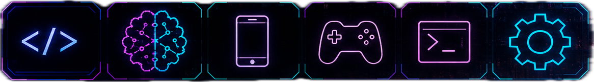
   
  <h1>Hi, I'm Luigui Paccine 👋</h1>
  <h3>
    Full Stack Software Engineer | Game Developer | Backend, Mobile, AI, Games &amp; Automation
  </h3>
  

    I build scalable web, mobile, backend and game solutions — from SaaS platforms to titles with 1M+ downloads.
  

---

## 🚀 About Me

I'm a Full Stack Software Engineer from Brazil, focused on building SaaS platforms, APIs, mobile applications, automation tools, business management systems and **games with Unity3D**.

I have experience creating real-world products for companies, clinics and operational teams — and I've also **participated in game projects** for mobile and desktop platforms that together reached **over 1,000,000 downloads**. My work combines software engineering, product thinking, automation, game development and business strategy.

Currently, I work on products such as:

- **GestoDentis** — Dental clinic management SaaS.
- **Heyoo** — Omnichannel inbox SaaS with AI that answers, sells and gets paid.
- **MU Tales** — Dark fantasy MMORPG built with Unity and a C++ server.
- **P4 Studios** — Software engineering, apps, SaaS platforms and digital solutions.
- **Caesar** — Financial management SaaS concept with WhatsApp integration.
- **Unity3D Games** — Participated in mobile and desktop game projects with 1M+ downloads combined.
- **AI agents and automation tools** for business operations.

---

## 🧠 Main Tech Stack

  

---

## 🛠️ Technologies I Work With

### Backend

### Frontend

### Mobile

### Game Development

### Database

### DevOps & Cloud

---

## 🦷 Featured Product: GestoDentis

  
  <h3>GestoDentis</h3>
  

    A complete SaaS platform for dental clinic management — with web app, mobile apps for clinics and a dedicated patient app (GestoPacientes).
  

  
  
  

### What GestoDentis does

GestoDentis helps dental clinics manage their daily operations with tools for:

- Smart scheduling and appointment confirmation.
- Patient records and clinical history.
- Digital anamnesis and documents.
- Financial management and reports.
- Team and multi-clinic management.
- WhatsApp integration.
- AI-powered clinical summaries.
- Digital signatures for dentists and patients.

### 📱 Mobile Apps

GestoDentis is also available as **native mobile apps** on both **Google Play Store** and **Apple App Store**, with two dedicated apps for different audiences:

- **GestoDentis App** — for dental clinics, dentists and staff: manage appointments, patients, records and clinical workflow on the go.
- **GestoPacientes App** — for patients: book appointments, receive reminders, view clinical history, sign documents digitally and communicate directly with their clinic.

---

## 💬 Featured Product: Heyoo

  <a href="https://heyoo.com.br" target="_blank">
    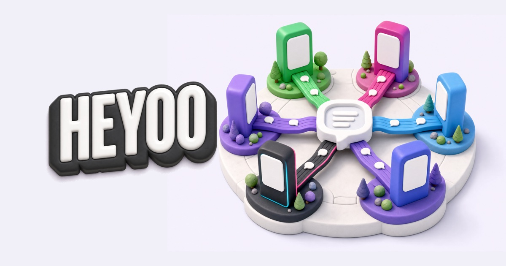
  </a>
  <h3>Heyoo</h3>
  

    The conversation hub for businesses that sell — every channel in a single inbox, with AI that answers, sells and gets paid.
  

  
  
  
  

### What Heyoo does

Heyoo is a multi-tenant SaaS that brings **WhatsApp, Instagram, Telegram, TikTok, Messenger and website chat** into one real-time inbox — with AI that understands audio and images, replies by voice, qualifies leads in the CRM, sells from the catalog and charges via PIX.

- 📥 **Unified inbox** — real-time conversations (Socket.IO) from every channel, groups, comments, tags and quick replies.
- 🤖 **AI that sells** — native credit-based provider or BYOK (OpenAI, Anthropic, Gemini, DeepSeek), tool-use over catalog, payments and scheduling.
- 🧩 **Visual Flow Builder** — no-code automations with conditions, HTTP requests, isolated JS (`isolated-vm`) and more.
- 📞 **AI voice calls** — WhatsApp calls with ElevenLabs voices, human pickup via WebRTC and native ringing (CallKit / ConnectionService).
- 💰 **Digital wallet & credit management** — native PIX sub-accounts with KYC, transaction PIN, contracts with Price table and automatic collection.
- 📊 **CRM, campaigns & reports** — multi-funnel Kanban, bulk messaging, PDF/Excel/CSV exports.
- 🔌 **Public REST API + MCP server** — 1,000+ endpoints, webhooks and embedded login for partners.
- 🎓 **[Heyoo Academy](https://academy.heyoo.com.br)** — 232 video lessons recorded on the real product, generated from code.

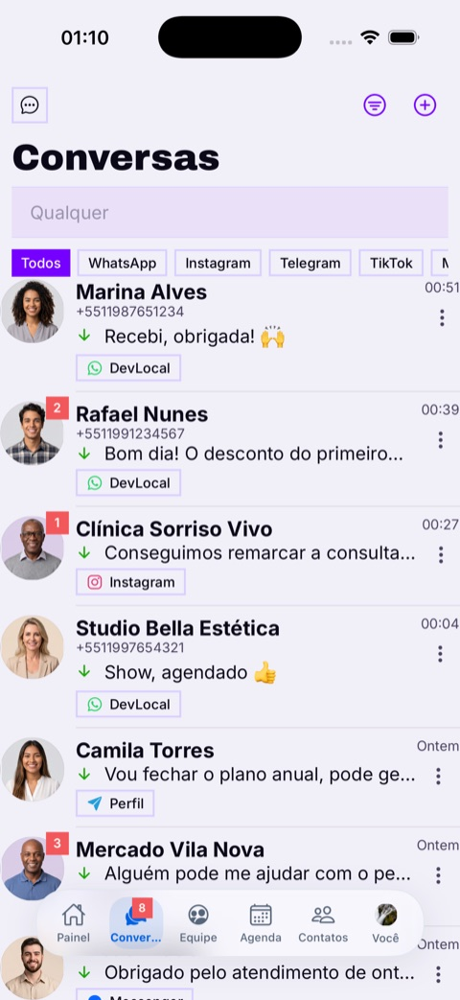
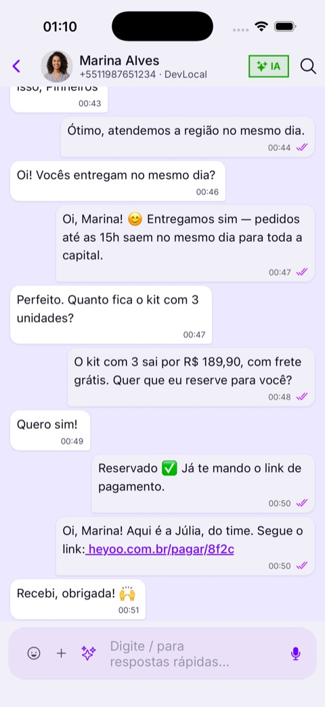
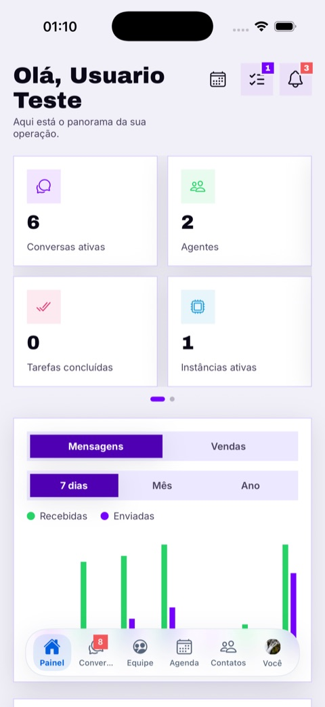
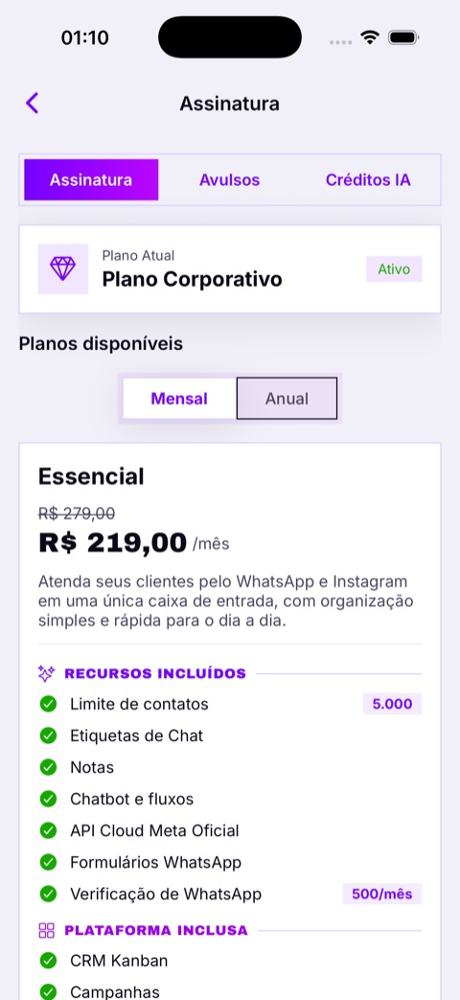

Inbox · conversation · dashboard · plans — screenshots from the published app

**Stack:**

---

## ⚔️ Featured Game: MU Tales

  
   
  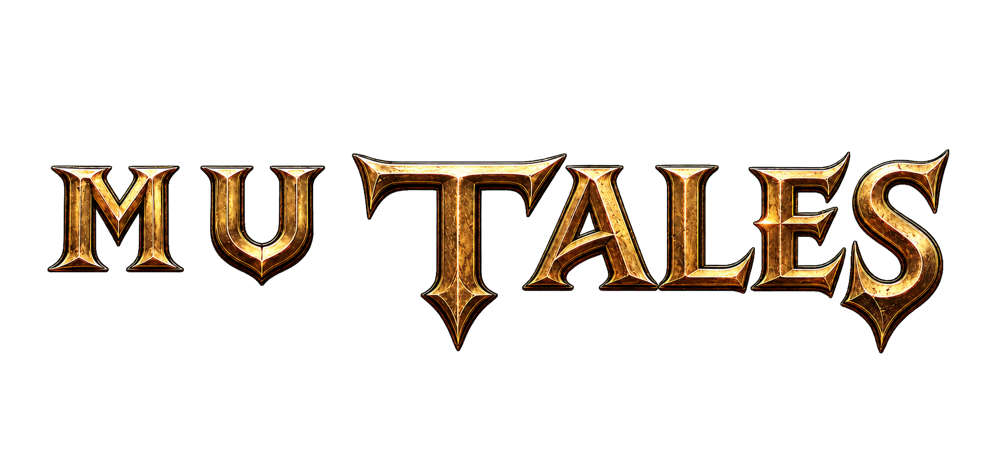
  

    <i>Every journey writes a new legend.</i>
  

  

    A dark fantasy MMORPG that blends the nostalgia of the classic MMORPG era with living chapters, events and stories that keep unfolding.
  

  
  
  
  

### What MU Tales is

- ⚔️ **Legendary classes** — knights, wizards, elves and their evolutions, with energy wings and iconic sets.
- 🏰 **PvE & PvP** — hunting, chapter-based quests and guild **Castle Siege**.
- 💱 **Player economy** — trading plus an item and character marketplace.
- 🌍 **Cross-platform** — one world across PC and mobile, with a coherent HUD on every screen.
- 🗣️ **Three languages** — pt-BR, en-US and es-419.

### Under the hood

- 🎮 **Client:** Unity 6.3 LTS, C# IL2CPP + **HybridCLR** hot-update and **xLua (Lua 5.3)** for gameplay logic.
- 🧭 **In-house native libraries** — navmesh, collision and **A\* + funnel pathfinding**, validated with **8.7M+ differential test cases across 231 maps with zero divergences**; shipped for macOS, iOS and Android (16 KB pages).
- 🖥️ **Server:** C++ x86-64 — 18 services and a 20-process cluster supervised by a custom daemon, MySQL persistence and a **Docker** runtime.

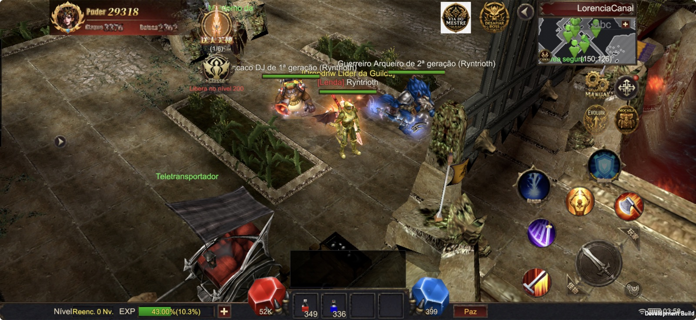

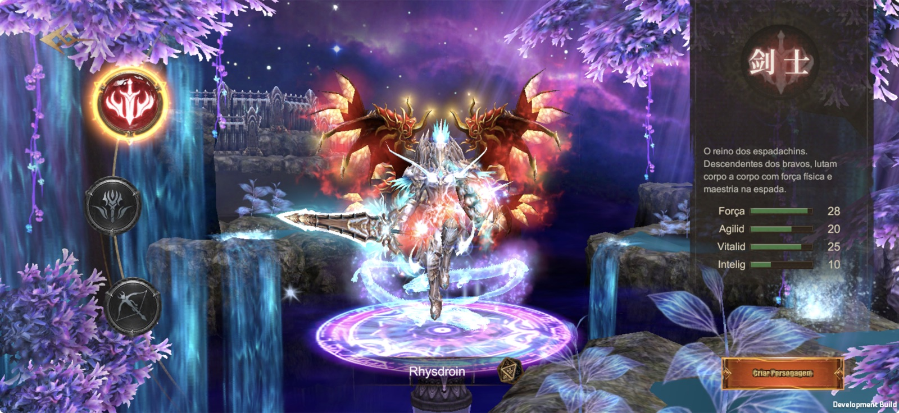
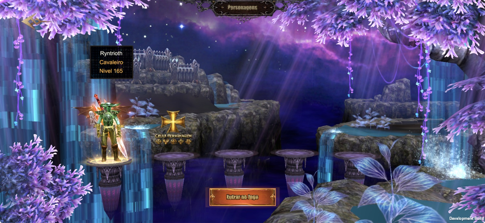

Real gameplay running on iPhone (development build, August 2026)

---

## 🏢 Company: P4 Studios

  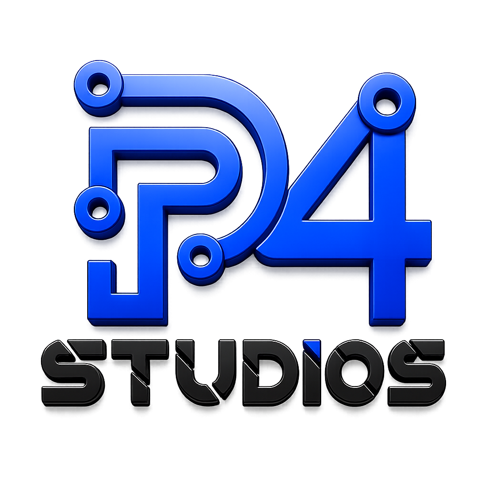
  <h3>P4 Studios</h3>
  

    Software Engineering, Apps, SaaS platforms and Digital Solutions.
  

  

---

## 🎮 Game Development with Unity3D

I've also worked on **Unity3D game projects** for mobile and desktop platforms, contributing to titles that have collectively reached a major milestone in the industry.

### What I do in game development

- 🎮 **Gameplay programming** — mechanics, physics, input systems and game loops in C#.
- 🕹️ **Multi-platform builds** — shipping the same title for Android, iOS and Windows/macOS desktop.
- 🧩 **Systems architecture** — save systems, state machines, scene management and modular components.
- 📈 **Live games & monetization** — analytics, ads, in-app purchases, remote config and player retention.
- 🚀 **Publishing pipeline** — Google Play Store, App Store and desktop distribution.
- 🎨 **Asset integration** — working with 3D models, animations, shaders and UI for performant builds.

### Milestones

- 🏆 **1,000,000+ total downloads** across the game projects I contributed to (mobile + desktop combined).
- 📱 Games published on **Google Play Store** with active player bases.
- 💻 Desktop releases reaching international audiences.
- 🛠️ Hands-on experience across the game lifecycle: prototype → production → release → live operations.
- ⚔️ Currently building **[MU Tales](https://mutales.online)** — a cross-platform MMORPG with a Unity 6 client, C++ server and in-house native libraries.

---

## 📌 Main Projects

### 🦷 GestoDentis

A complete SaaS platform for dental clinics, focused on organization, productivity, financial control, patient management and clinic growth.

**Stack examples:**

[Visit GestoDentis](https://gestodentis.com.br/)

---

### 💬 Heyoo

An omnichannel customer service and sales platform — WhatsApp, Instagram, Telegram, TikTok, Messenger and website chat in one inbox, with AI agents, visual flows, CRM, campaigns, AI voice calls and a native PIX wallet. Web app plus iOS and Android apps.

**Stack examples:**

[Visit Heyoo](https://heyoo.com.br) · [App Store](https://apps.apple.com/br/app/heyoo/id6795676694) · [Google Play](https://play.google.com/store/apps/details?id=br.com.p4.heyoo)

---

### ⚔️ MU Tales

A dark fantasy MMORPG with a Unity client for iOS, Android, Windows and macOS, a C++ server cluster and in-house native libraries (navmesh, pathfinding, asset I/O and Lua runtime).

**Stack examples:**

[Visit MU Tales](https://mutales.online) · [mutales.com.br](https://mutales.com.br)

---

## 📊 GitHub Activity & Stats

> 🔒 **Note:** Most of my work lives in **private repositories** — proprietary SaaS products, client projects and internal tools built under P4 Studios. The numbers below reflect my real activity, including private commits.

> The bulk of my engineering work happens in **private codebases** for products like **GestoDentis**, **Heyoo**, **Caesar** and internal **P4 Studios** systems, plus game development projects with Unity3D such as **MU Tales**.

---

## 🛡️ Security & Pentest

I also work with **application security**, **penetration testing** and **secure development** practices for the SaaS products I build — protecting patient data, financial information and business operations.

### Areas of expertise

### Tools & Frameworks

### What I focus on

- 🔐 Authentication, authorization and JWT/session hardening
- 🧪 Input validation, injection prevention (SQLi, NoSQLi, XSS, SSRF)
- 🔑 Secrets management and secure environment configuration
- 🛂 Role-based access control (RBAC) and multi-tenant isolation
- 📜 LGPD / GDPR compliant data handling (patient & financial data)
- 🧱 Secure CI/CD pipelines and dependency vulnerability scanning
- 🕵️ Authorized penetration testing on the products I build and maintain

---

## 🌎 Open to Opportunities

I'm open to remote international opportunities, especially in:

- Backend Development
- Full Stack Development
- QA Engineering
- SaaS Products
- API Development
- Automation
- AI-powered business tools
- Web and Mobile Applications
- Application Security & Penetration Testing
- Game Development (Unity3D / C# — mobile & desktop)

